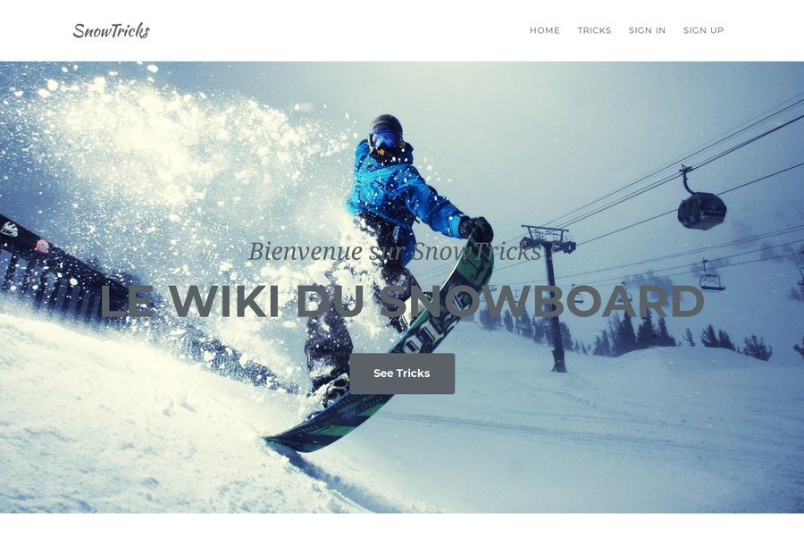

# Snowtricks

It's a Symfony 5.3 project. A community of snowboarder to learn how to make tricks.

---



---

## Getting Started

These instructions will get you a copy of the project up and running on your local machine for development and testing purposes.

### Prerequisites

What things you need to install the software and how to install them

```
PHP 8
MySQL 5.7
```

### Installing

First :

```
Git clone https://github.com/alexandrecorroy/Snowtricks.git
```

Update ".env" with your parameters

```

Install Dependencies :

```
composer install
```

Install DB :

```
php bin/console doctrine:schema:update --force
```

Install fixtures :

```
php bin/console doctrine:fixtures:load
```

To test user features, an user will be created with : 

```
login : userdemo
password : userdemo
```

## Docker

Docker installation :
```
docker-compose up -d
```

## Tests

Testing the application with PHPUnit in Snowtricks folder :
```
./vendor/bin/simple-phpunit
```

## Authors

* **Corroy Alexandre** - *Initial work* - [CORROYAlexandre](https://github.com/alexandrecorroy)

## License

This project is licensed under the MIT License - see the [LICENSE.md](LICENSE.md) file for details

## SensioLabs Insight

[](https://insight.sensiolabs.com/projects/a335a0a7-d213-4b27-bd40-e2c9feec75af)
